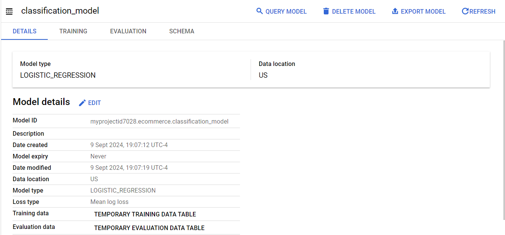
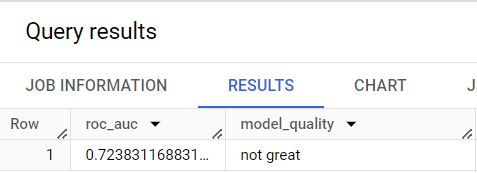

# About this project

Title : Predicting Visitor Purchases with BigQuery ML

Objective : 
1.  Use BigQuery to find public datasets
2.  Query and explore the ecommerce dataset
3.  Create a training and evaluation dataset to be used for batch prediction
4.  Create a classification (logistic regression) model in BigQuery ML
5.  Evaluate the performance of your machine learning model
6.  Predict and rank the probability that a visitor will make a purchase


**BigQuery ML** can create, train, evaluate, and predict with ML models.

## About dataset

The dataset contains information >about customers, products, orders, logistics, web events and digital marketing campaigns. The contents of this >dataset are synthetic, and are provided to industry practitioners for the purpose of product discovery, testing, and >evaluation.

Information about different feature can be found on this link 

https://support.google.com/analytics/answer/3437719?hl=en

_________________________________________________


## STEP 1 : Explore ecommerce data

>>**what % made a purchase**?

* Query

```SQL
WITH visitors AS(
SELECT
COUNT(DISTINCT fullVisitorId) AS total_visitors
FROM `data-to-insights.ecommerce.web_analytics`
),

purchasers AS(
SELECT
COUNT(DISTINCT fullVisitorId) AS total_purchasers
FROM `data-to-insights.ecommerce.web_analytics`
WHERE totals.transactions IS NOT NULL
)

SELECT
  total_visitors,
  total_purchasers,
  total_purchasers / total_visitors AS conversion_rate
FROM visitors, purchasers

```

* Result


>>**top 5 selling product**s
Query
```sql
SELECT
  p.v2ProductName,
  p.v2ProductCategory,
  SUM(p.productQuantity) AS units_sold,
  ROUND(SUM(p.localProductRevenue/1000000),2) AS revenue
FROM `data-to-insights.ecommerce.web_analytics`,
UNNEST(hits) AS h,
UNNEST(h.product) AS p
GROUP BY 1, 2
ORDER BY revenue DESC
LIMIT 5;
```


>>**How many visitors bought on subsequent visits to the website?
could have bought on first as well**
* Query 
```sql

WITH all_visitor_stats AS (
SELECT
  fullvisitorid, # 741,721 unique visitors
  IF(COUNTIF(totals.transactions > 0 AND totals.newVisits IS NULL) > 0, 1, 0) AS will_buy_on_return_visit
  FROM `data-to-insights.ecommerce.web_analytics`
  GROUP BY fullvisitorid
)

SELECT
  COUNT(DISTINCT fullvisitorid) AS total_visitors, will_buy_on_return_visit
FROM all_visitor_stats
GROUP BY will_buy_on_return_visit

```

* Result


In the world of online marketing, identifying and marketing to these future customers based on the characteristics of their first visit will increase conversion rates and reduce the outflow to competitor sites.

## STEP 2 : features selection and training dataset formation

test whether these two fields are good inputs for your classification model:

1.  **totals.bounces**    (whether the visitor left the website immediately)
2.  **totals.timeOnSite**   (how long the visitor was on our website)

```sql
SELECT
  * EXCEPT(fullVisitorId)
FROM

  # features
  (SELECT
    fullVisitorId,
    IFNULL(totals.bounces, 0) AS bounces,
    IFNULL(totals.timeOnSite, 0) AS time_on_site
  FROM
    `data-to-insights.ecommerce.web_analytics`
  WHERE
    totals.newVisits = 1)
  JOIN
  (SELECT
    fullvisitorid,
    IF(COUNTIF(totals.transactions > 0 AND totals.newVisits IS NULL) > 0, 1, 0) AS will_buy_on_return_visit
  FROM
      `data-to-insights.ecommerce.web_analytics`
  GROUP BY fullvisitorid)
  USING (fullVisitorId)
ORDER BY time_on_site DESC
LIMIT 10;

```

* Result


* Conclusion

 **will_buy_on_return_visit** is not known after the first visit. Again, predicting for a subset of users who returned to your website and purchased. Since we don't know the future at prediction time, you cannot say with certainty whether a new visitor comes back and purchases.

Q : time_on_site and bounces will be a good indicator of whether the user will return and purchase or not?

Answer : It's often too early to tell before training and evaluating the model, but at first glance out of the top 10 time_on_site, only 1 customer returned to buy, which isn't very promising. 


## STEP 3 : Create a BigQuery dataset to store models

We will create dataset with Dataset ID : **ecommerce**.


## STEP 4 : Selection  of BigQuery ML model type and options

* Query 

```sql
CREATE OR REPLACE MODEL `ecommerce.classification_model`
OPTIONS
(
model_type='logistic_reg',
labels = ['will_buy_on_return_visit']
)
AS

#standardSQL
SELECT
  * EXCEPT(fullVisitorId)
FROM

  # features
  (SELECT
    fullVisitorId,
    IFNULL(totals.bounces, 0) AS bounces,
    IFNULL(totals.timeOnSite, 0) AS time_on_site
  FROM
    `data-to-insights.ecommerce.web_analytics`
  WHERE
    totals.newVisits = 1
    AND date BETWEEN '20160801' AND '20170430') # train on first 9 months
  JOIN
  (SELECT
    fullvisitorid,
    IF(COUNTIF(totals.transactions > 0 AND totals.newVisits IS NULL) > 0, 1, 0) AS will_buy_on_return_visit
  FROM
      `data-to-insights.ecommerce.web_analytics`
  GROUP BY fullvisitorid)
  USING (fullVisitorId)
;
```

* Output




* Result


## STEP 5 :   Evaluation

For this classification problems you want to minimize the False Positive Rate (predict that the user will return and purchase and they don't) and maximize the True Positive Rate (predict that the user will return and purchase and they do).

This relationship is visualized with a ROC (Receiver Operating Characteristic) curve like the one shown here, where you try to maximize the area under the curve or AUC.

BigQuery ML, roc_auc is simply a queryable field when evaluating your trained ML model.

* Query 

```sql
SELECT
  roc_auc,
  CASE
    WHEN roc_auc > .9 THEN 'good'
    WHEN roc_auc > .8 THEN 'fair'
    WHEN roc_auc > .7 THEN 'not great'
  ELSE 'poor' END AS model_quality
FROM
  ML.EVALUATE(MODEL ecommerce.classification_model,  (

SELECT
  * EXCEPT(fullVisitorId)
FROM

  # features
  (SELECT
    fullVisitorId,
    IFNULL(totals.bounces, 0) AS bounces,
    IFNULL(totals.timeOnSite, 0) AS time_on_site
  FROM
    `data-to-insights.ecommerce.web_analytics`
  WHERE
    totals.newVisits = 1
    AND date BETWEEN '20170501' AND '20170630') # eval on 2 months
  JOIN
  (SELECT
    fullvisitorid,
    IF(COUNTIF(totals.transactions > 0 AND totals.newVisits IS NULL) > 0, 1, 0) AS will_buy_on_return_visit
  FROM
      `data-to-insights.ecommerce.web_analytics`
  GROUP BY fullvisitorid)
  USING (fullVisitorId)

));
```

* Result



roc_auc of 0.72, which shows that the model has not great predictive power. Since the goal is to get the area under the curve as close to 1.0 as possible, there is room for improvement.


Task 6. Improve model performance with feature engineering